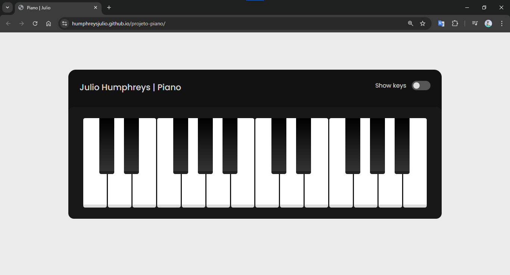
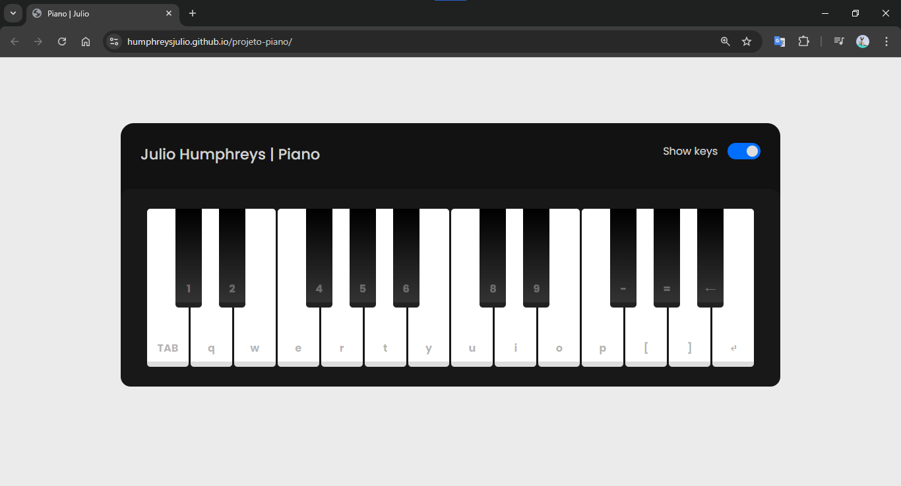
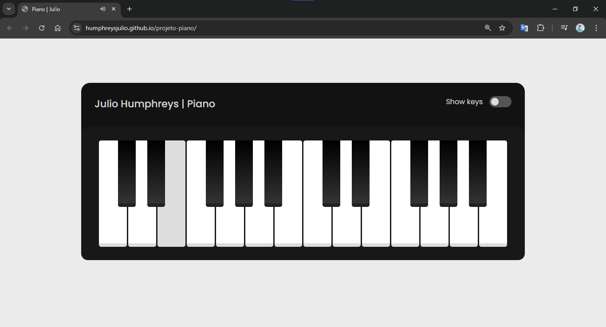

## Digital Piano

## 📝 | Project description
Este projeto é um Piano Digital interativo com 24 notas, que permite ao usuário tocar tanto utilizando o teclado do computador quanto clicando diretamente nas teclas através de uma interface gráfica intuitiva.

This project is an interactive Digital Piano with 24 notes, which allows the user to play either using the computer keyboard or by clicking directly on the keys through an intuitive graphical interface.

## 📚 | Stack

  
  
  

## 🛠 | Tools
- Visual Studio Code
- Google Fonts
- Free Formatter*

**__Free Formatter__* é um site útil para consultar a lista completa de entidades HTML, fornecendo tanto seus números quanto seus nomes. Ele também inclui os caracteres ASCII que podem ser representados em HTML, facilitando a codificação e exibição correta de símbolos especiais em páginas web.

**__Free Formatte__* is a useful site for consulting the complete list of HTML entities, providing both their numbers and their names. It also includes the ASCII characters that can be represented in HTML, making it easier to encode and correctly display special symbols on web pages.

## 🖥 | Previews

  
  
  
  

## 🌎 | Website
https://humphreysjulio.github.io/projeto-piano/

## 👨‍💻 | Dev
Julio César Humphreys Reis
