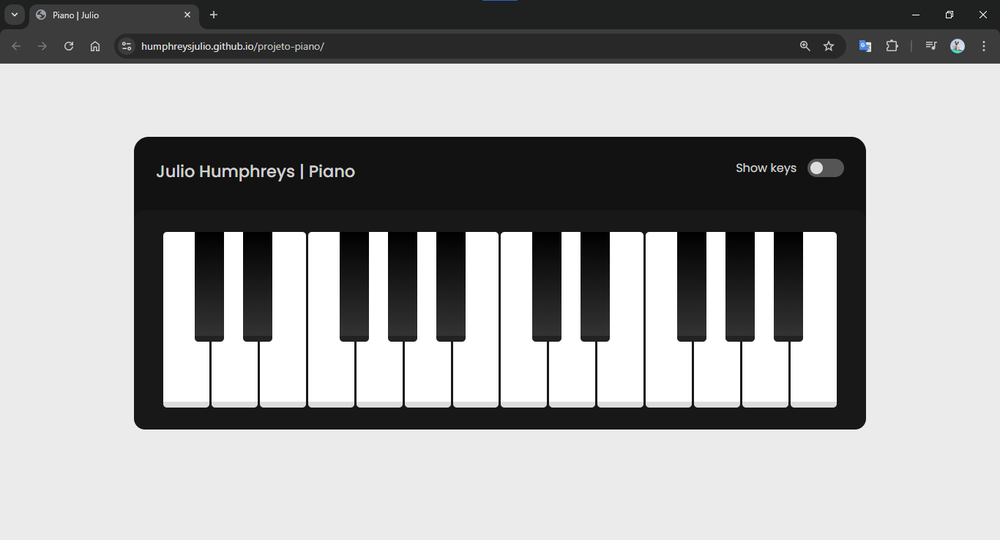
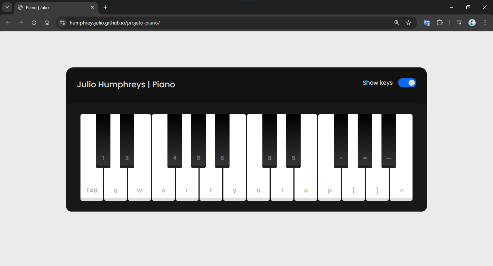
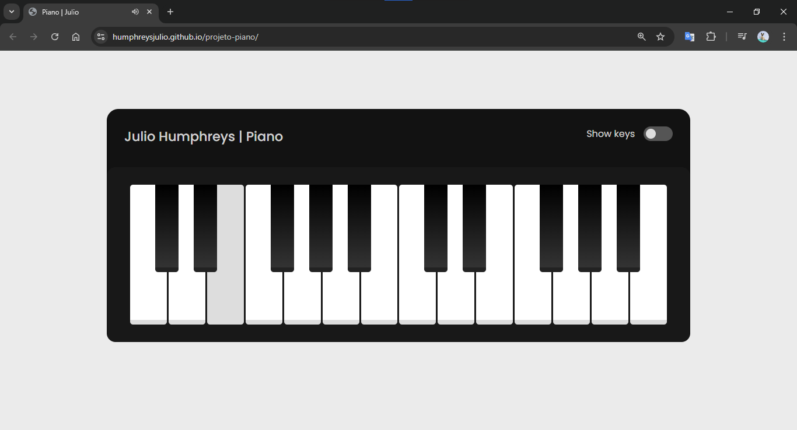

## Digital Piano

## 📝 | Project description
O piano digital é uma aplicação interativa que simula um piano com 24 notas, permitindo ao usuário tocar as notas usando o teclado do computador ou clicando diretamente nas teclas virtuais na interface gráfica. A ferramenta oferece uma experiência intuitiva para explorar música e praticar melodias.

The digital piano is an interactive application that simulates a piano with 24 notes, allowing the user to play notes using the computer keyboard or by clicking directly on the virtual keys in the graphical interface. The tool offers an intuitive experience for exploring music and practicing melodies.

## ⚙ | Features
- __Interação com o Teclado:__ As notas podem ser tocadas usando teclas do computador, proporcionando uma experiência de uso rápida e prática.
- __Interface Gráfica Intuitiva:__ As teclas virtuais na tela permitem que o usuário toque as notas clicando diretamente nelas, simulando o toque em um piano real.
- __Exibição de Símbolos das Teclas:__ O piano digital possui uma função opcional que exibe os símbolos das teclas do teclado do computador sobre as teclas virtuais correspondentes.
- __24 Notas Disponíveis:__ A aplicação abrange duas oitavas completas, com 24 notas no total, incluindo as teclas brancas e pretas, proporcionando uma boa variedade para prática e experimentação musical.
- __Feedback Visual:__ Cada tecla tocada (seja pelo teclado ou pelo clique) muda de cor ao ser pressionada, dando ao usuário um retorno visual imediato da ação.
   
   
- __Keyboard Interaction:__ Notes can be played using computer keys, providing a fast and convenient user experience.
- __Intuitive Graphical Interface:__ On-screen virtual keys allow the user to play notes by clicking directly on them, simulating playing on a real piano.
- __Key Symbol Display:__ The digital piano has an optional function that displays the symbols of the computer keyboard keys over the corresponding virtual keys.
- __24 Available Notes:__ The application covers two full octaves, with 24 notes in total, including both white and black keys, providing a good variety for musical practice and experimentation.
- __Visual Feedback:__ Each key played (whether by keyboard or by clicking) changes color when pressed, giving the user immediate visual feedback of the action.

## 📚 | Stack

  
  
  

## 🛠 | Tools
- Visual Studio Code
- Google Fonts
- Free Formatter*

**__Free Formatter__* é um site útil para consultar a lista completa de entidades HTML, fornecendo tanto seus números quanto seus nomes. Ele também inclui os caracteres ASCII que podem ser representados em HTML, facilitando a codificação e exibição correta de símbolos especiais em páginas web.

**__Free Formatter__* is a useful site for consulting the complete list of HTML entities, providing both their numbers and their names. It also includes the ASCII characters that can be represented in HTML, making it easier to encode and correctly display special symbols on web pages.

## 🖥 | Previews

  <h3>Website</h3>
  
  
  
  

## 🌎 | Website
Visite o meu site <a href="https://humphreysjulio.github.io/projeto-piano/" target="_blank">aqui</a>

Visit my website <a href="https://humphreysjulio.github.io/projeto-piano/" target="_blank">here</a>

## 👨‍💻 | Dev
Julio César Humphreys Reis
